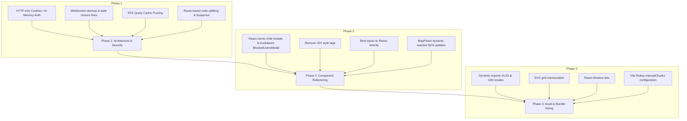

# Oyna Admin Panel — Frontend Performance & Code Quality Analysis Report

This document contains a comprehensive, file-by-file performance and code quality audit of the React web admin panel frontend located in `OynaAdminPanel-main/OynaAdminPanel`.

---

## 📊 Executive Summary & Key Metrics

Our deep audit of the frontend source code identified **over 65 performance, safety, and architectural issues** across 30+ files. The code features beautiful UI styling and smooth transitions, but lacks optimization protocols needed for high-performance enterprise React applications.

### Severity Breakdown
- 🔴 **Critical (14)**: Issues causing severe memory leaks, redundant render cascades, massive bundle sizes (~1MB bundle bloat due to unbundled libraries), dynamic unmount/remount anti-patterns, and data-layer synchronization issues.
- 🟡 **Medium (30)**: Issues causing high CPU usage, browser reflows (e.g., dynamic JSX `<style>` tags re-parsed on every render), unnecessary unmounts/remounts of Leaflet maps, and missing global error boundaries.
- 🟢 **Low (23)**: General optimization improvements, missing memoization, un-stabilized function handlers, stale closures in socket events, and date formatting overhead in loops.

---

## 🔴 Critical Performance & Architectural Issues

### 1. Duplicated State Syncing & Render Cascades (Redux vs. Local State)
- **Files**: 
  - [AddVenue.jsx](file:///c:/Users/ASUS/Desktop/OynaBeta/oyna/OynaAdminPanel-main/OynaAdminPanel/src/pages/AddVenue.jsx#L33-L66)
  - [AddSpecs.jsx](file:///c:/Users/ASUS/Desktop/OynaBeta/oyna/OynaAdminPanel-main/OynaAdminPanel/src/pages/AddSpecs.jsx#L54-L184)
  - [MediaPricing.jsx](file:///c:/Users/ASUS/Desktop/OynaBeta/oyna/OynaAdminPanel-main/OynaAdminPanel/src/pages/MediaPricing.jsx#L28-L50)
- **Problem**: These multi-step creation pages use Redux (`venueFormSlice`) as a global repository, but then declare 10+ local `useState` hooks initialized from Redux. Every time the Redux store changes, a massive `useEffect` block triggers and forces 10+ synchronous local `setState` updates. This leads to **rendering cascades** (5 to 10 back-to-back re-renders in a single call-stack) and bypasses the single-source-of-truth paradigm.
- **Fix**: Bind JSX inputs directly to Redux selector values or a single local form state object:
  ```javascript
  const venueForm = useSelector((state) => state.venueForm);
  // Bind directly: value={venueForm.name} 
  // Dispatch directly: onChange={(e) => dispatch(updateField({ name: e.target.value }))}
  ```

### 2. Large, Unbundled Libraries Incurring Massive Initial Load Times
- **File**: [Dashboard.jsx](file:///c:/Users/ASUS/Desktop/OynaBeta/oyna/OynaAdminPanel-main/OynaAdminPanel/src/pages/Dashboard.jsx#L4)
- **Problem**: The library `xlsx` is imported statically: `import * as XLSX from 'xlsx';` inside the Dashboard page. XLSX is a massive, heavy library (~1MB unminified) that is only used when the user clicks "Export to Excel". Statically importing it forces it into the main bundle, causing a huge delay in the application's **Time to Interactive (TTI)**.
- **Fix**: Implement dynamic importing (`import()`) so that the XLSX library is only fetched from the server when the user triggers the export button:
  ```javascript
  const handleExport = async () => {
    const XLSX = await import('xlsx');
    // Proceed with XLSX sheet generation...
  };
  ```

### 3. Simulation Canvas Render Bottlenecks during Zoom / Drag / Pan
- **File**: [Simulation.jsx](file:///c:/Users/ASUS/Desktop/OynaBeta/oyna/OynaAdminPanel-main/OynaAdminPanel/src/pages/Simulation.jsx)
- **Problem**: The interactive simulation grid canvas stores items, lines, zoom, and panning coordinates as single-component `useState` items. When dragging an object, panning, or changing the zoom level, it updates state and re-renders **every single child node** (grids, lines, tables, PlayStation icons) on every pixel movement.
- **Fix**: 
  - Separate the SVG grid lines into a standalone component wrapped in `React.memo` since grid configurations rarely change.
  - Offload real-time pan and zoom coordinates to CSS Custom Properties (Variables) set directly on the DOM wrapper styles via refs, preventing React component tree re-renders entirely during panning/zooming.

### 4. Memory Leaks in Socket Event Listeners
- **File**: [DashboardLayout.jsx](file:///c:/Users/ASUS/Desktop/OynaBeta/oyna/OynaAdminPanel-main/OynaAdminPanel/src/components/DashboardLayout.jsx#L26-L115)
- **Problem**: The global WebSocket client listens to various events (`layoutUpdate`, `venueStatusUpdate`) and dispatch actions using RTK Query `invalidateTags` (lines 85 and 102) using dynamic imports *inside* the socket callback. However, when the user logs out or the component unmounts, there are no checks to detach the callbacks before calling `socket.disconnect()`, which can lead to hanging listeners.
- **Fix**: Strictly detach listeners in the cleanup return of the `useEffect`:
  ```javascript
  useEffect(() => {
    // ... setup socket
    return () => {
      socket.off('layoutUpdate');
      socket.off('venueStatusUpdate');
      socket.disconnect();
    };
  }, [dispatch, user]);
  ```

### 5. No Route-Based Code Splitting — All Pages Eagerly Loaded `[NEW]`
- **File**: [App.jsx](file:///c:/Users/ASUS/Desktop/OynaBeta/oyna/OynaAdminPanel-main/OynaAdminPanel/src/App.jsx#L6-L21)
- **Problem**: All 16 pages are statically imported at the top of `App.jsx`. There is zero use of `React.lazy()` or `Suspense`. Every page component, regardless of how rarely it is visited (e.g. `SuperAdmin`, `Help`, `EditFood`), is bundled into the initial JS payload, making the main bundle unnecessarily large and dragging down TTI.
- **Fix**: Wrap routes with `React.lazy()` and use `<Suspense fallback={<LoadingSpinner />}>` around the route switcher:
  ```javascript
  const Simulation = React.lazy(() => import('./pages/Simulation'));
  ```

### 6. BlockedUsersModal Component Defined Inside Venues.jsx Component Body `[NEW]`
- **File**: [Venues.jsx](file:///c:/Users/ASUS/Desktop/OynaBeta/oyna/OynaAdminPanel-main/OynaAdminPanel/src/pages/Venues.jsx#L9-L58)
- **Problem**: The `BlockedUsersModal` component is declared *inside* the body of the `Venues` component. This is a massive React anti-pattern. On every single render of `Venues`, a brand-new component definition is created in memory. React sees this as a new component type and is forced to completely unmount and remount the modal on every update, losing internal state and re-running all setup effects.
- **Fix**: Move `BlockedUsersModal` outside the `Venues` component scope, either to the bottom of the file (module scope) or into its own file under `src/components/`.

### 7. getVenueLayout queryFn Makes Double HTTP Calls `[NEW]`
- **File**: [venuesApi.js](file:///c:/Users/ASUS/Desktop/OynaBeta/oyna/OynaAdminPanel-main/OynaAdminPanel/src/store/api/venuesApi.js#L124-L133)
- **Problem**: The custom `queryFn` for `getVenueLayout` fires a GET request to `/layout`, and if it returns a `404` (representing a missing or uninitialized layout endpoint), it falls back to a second GET request to fetch the entire venue object. This means every venue without a dedicated layout endpoint incurs **two sequential HTTP requests** on load (the first of which is guaranteed to fail).
- **Fix**: Check for layout endpoint existence conditionally, or better, modify the backend layout controller to return a standard empty layout `{ items: [] }` with a `200` status instead of throwing a `404`.

### 8. Inconsistent Authorization Header Casing Across API Slices `[NEW]`
- **Files**:
  - `venuesApi.js` (line 8: `Authorization`)
  - `foodApi.js` (line 10: `Authorization`)
  - `reservationsApi.js` (line 10: `authorization`)
  - `dashboardApi.js` (line 10: `authorization`)
- **Problem**: Two API slices set the header as `Authorization` (capital A) and two use `authorization` (lowercase a). Although HTTP headers are case-insensitive by standard, intermediate network nodes, reverse proxies, API gateways (such as certain case-sensitive Cloudflare Worker or Nginx rules) might treat them as different headers, introducing hard-to-debug integration failures.
- **Fix**: Standardize on `Authorization` (CamelCase) across all slices.

### 9. foodApi.getFoods providesTags Will Crash on Non-Array Result `[NEW]`
- **File**: [foodApi.js](file:///c:/Users/ASUS/Desktop/OynaBeta/oyna/OynaAdminPanel-main/OynaAdminPanel/src/store/api/foodApi.js#L20-L23)
- **Problem**: The `providesTags` function default parameter is `result = []`, but if the API returns an error response object or a falsy non-array type, the expansion `...result.map(...)` will crash the application with `TypeError: result.map is not a function`, breaking RTK Query's cache and tag invalidation completely.
- **Fix**: Guard the tag formatting logic safely:
  ```javascript
  providesTags: (result) => 
    Array.isArray(result) 
      ? ['Foods', ...result.map((food) => ({ type: 'Foods', id: food._id }))]
      : ['Foods']
  ```

---

## 🟡 Medium Performance & Code Quality Issues

### 1. Inefficient Inline `<style>` Blocks in JSX Rendering
- **Files**: Present in almost all UI files, notably:
  - [Food.jsx](file:///c:/Users/ASUS/Desktop/OynaBeta/oyna/OynaAdminPanel-main/OynaAdminPanel/src/pages/Food.jsx#L38-L94)
  - [AddVenue.jsx](file:///c:/Users/ASUS/Desktop/OynaBeta/oyna/OynaAdminPanel-main/OynaAdminPanel/src/pages/AddVenue.jsx#L183-L195)
  - [FoodForm.jsx](file:///c:/Users/ASUS/Desktop/OynaBeta/oyna/OynaAdminPanel-main/OynaAdminPanel/src/components/FoodForm.jsx#L89-L107)
  - [Venues.jsx](file:///c:/Users/ASUS/Desktop/OynaBeta/oyna/OynaAdminPanel-main/OynaAdminPanel/src/pages/Venues.jsx#L38-L50)
- **Problem**: These components inject raw `<style>{...}</style>` tags directly into the virtual DOM. Every single time the component re-renders (e.g. typing a letter, opening a modal), the browser must **re-parse and re-apply** this CSS, causing layout shifts and high CPU paint overhead.
- **Fix**: Move these custom styles to `src/index.css` or use standard Tailwind CSS classes instead of browser-override classes.

### 2. Large Array Iterations & Unmemoized Matrix Computations in Render Path
- **File**: [Simulation.jsx](file:///c:/Users/ASUS/Desktop/OynaBeta/oyna/OynaAdminPanel-main/OynaAdminPanel/src/pages/Simulation.jsx#L795)
- **Problem**: Collision checking (`checkCollision`) iterates through the list of all nodes and layout segments on every frame during dragging. This is executed directly inside render hooks.
- **Fix**: Wrap structural computations in `useMemo` so they are only calculated when the `items` array length or item dimensions actually change.

### 3. Missing Memoization on Child Modals and Heavy Pickers
- **Files**:
  - [LogoCropperModal.jsx](file:///c:/Users/ASUS/Desktop/OynaBeta/oyna/OynaAdminPanel-main/OynaAdminPanel/src/components/LogoCropperModal.jsx)
  - [MapPicker.jsx](file:///c:/Users/ASUS/Desktop/OynaBeta/oyna/OynaAdminPanel-main/OynaAdminPanel/src/components/MapPicker.jsx)
  - [SettingsModal.jsx](file:///c:/Users/ASUS/Desktop/OynaBeta/oyna/OynaAdminPanel-main/OynaAdminPanel/src/components/SettingsModal.jsx)
- **Problem**: These child components receive callbacks and settings objects as props. Because they are not wrapped in `React.memo`, they **re-render entirely** every single time their parent re-renders, even when they are closed or their props haven't changed.
- **Fix**: Wrap child modal exports in `React.memo`:
  ```javascript
  export default React.memo(SettingsModal);
  ```

### 4. Vite Config Lacks Build-Time Optimization & Code Splitting `[NEW]`
- **File**: [vite.config.js](file:///c:/Users/ASUS/Desktop/OynaBeta/oyna/OynaAdminPanel-main/OynaAdminPanel/vite.config.js)
- **Problem**: The Vite configuration has no manual chunks splitting. Every library in `node_modules` (including XLSX, Leaflet, Socket.io-client, react-icons) is compiled into a single giant vendor chunk. This results in huge asset bundle warning limits being hit and slows page download speeds.
- **Fix**: Configure Rollup's chunk output splitting inside `vite.config.js`:
  ```javascript
  build: {
    rollupOptions: {
      output: {
        manualChunks(id) {
          if (id.includes('node_modules')) {
            if (id.includes('xlsx')) return 'vendor-xlsx';
            if (id.includes('leaflet')) return 'vendor-leaflet';
            if (id.includes('react-icons')) return 'vendor-icons';
            return 'vendor';
          }
        }
      }
    }
  }
  ```

### 5. Duplicate fetchBaseQuery Token Logic Across All 5 API Slices `[NEW]`
- **Files**: All 5 API slice files (`authApi.js`, `foodApi.js`, `venuesApi.js`, `reservationsApi.js`, `dashboardApi.js`)
- **Problem**: Every API slice defines a separate `fetchBaseQuery` instance repeating the same logic to read the token from `localStorage` and assign the bearer authorization headers. This is a duplicate of the exact same 8-10 lines of setup in 5 different files.
- **Fix**: Extract a shared base query factory helper in a new file (e.g. `src/store/api/baseQuery.js`) and reuse it across all API slices.

### 6. MapPicker Forced Remount via coordinate key Prop `[NEW]`
- **File**: [AddVenue.jsx](file:///c:/Users/ASUS/Desktop/OynaBeta/oyna/OynaAdminPanel-main/OynaAdminPanel/src/pages/AddVenue.jsx#L429)
- **Problem**: `MapPicker` receives coordinates inside its key: `key={`${coords.lat}-${coords.lng}-readonly``. On every single coordinate change, React is forced to **completely destroy (unmount) and recreate (remount)** the entire map element. This triggers full Leaflet map re-initializations, costing severe UI lag, rather than utilizing the Leaflet map flyTo/setView methods.
- **Fix**: Remove coordinates from the `key` prop and use Leaflet's reactive hook/API (`useMap`) inside `MapPicker` to transition panning smoothly when props change.

### 7. No Global Error Boundaries `[NEW]`
- **Files**: Entire application
- **Problem**: There is not a single `<ErrorBoundary>` component or `componentDidCatch` block anywhere in the project. If a rendering crash happens inside a complex view (e.g., the Canvas Simulation drawing SVG connections), it will immediately crash the entire React application tree, throwing a blank white screen to the admin user.
- **Fix**: Wrap the primary content areas inside `App.jsx` in an `ErrorBoundary` component to gracefully catch errors and display fallback error screens.

### 8. Dark Mode Flash of Unstyled Content (FOUC) due to Async theme Setup `[NEW]`
- **File**: [App.jsx](file:///c:/Users/ASUS/Desktop/OynaBeta/oyna/OynaAdminPanel-main/OynaAdminPanel/src/App.jsx#L34-L43)
- **Problem**: The dark/light theme initialization runs inside a React `useEffect` after mount. This causes the initial HTML to paint in the default style (light mode), and then flip to dark mode milliseconds later, causing a jarring, highly un-premium "flash of unstyled content".
- **Fix**: Execute the dark mode class detection synchronously in a small `<script>` tag inside `index.html` head before React's engine boots:
  ```html
  <script>
    if (localStorage.getItem('theme') === 'dark' || (!localStorage.getItem('theme') && window.matchMedia('(prefers-color-scheme: dark)').matches)) {
      document.documentElement.classList.add('dark');
    }
  </script>
  ```

---

## 🟢 Low-Level Optimizations & Code Quality

### 1. Constant Data Arrays Declared inside Components
- **File**: [Sidebar.jsx](file:///c:/Users/ASUS/Desktop/OynaBeta/oyna/OynaAdminPanel-main/OynaAdminPanel/src/components/Sidebar.jsx#L18-L34)
- **Problem**: The `navItems` array is declared inside the `Sidebar` component. This array is completely static. Declaring it inside the function forces React to allocate a brand new array in heap memory on every single render.
- **Fix**: Move `navItems` to the module level (outside the `Sidebar` function scope).

### 2. Inline Style Objects Re-created Every Frame
- **File**: [AddVenue.jsx](file:///c:/Users/ASUS/Desktop/OynaBeta/oyna/OynaAdminPanel-main/OynaAdminPanel/src/pages/AddVenue.jsx#L237)
- **Problem**: Writing styles like `style={{ fontVariationSettings: "'FILL' 1" }}` allocates a new object reference on every render, triggering updates in down-stream child elements.
- **Fix**: Declare style constants at the top of the file:
  ```javascript
  const ICON_FILL_STYLE = { fontVariationSettings: "'FILL' 1" };
  ```

### 3. useEffect Socket Listener in Simulation Has Missing Dependencies `[NEW]`
- **File**: [Simulation.jsx](file:///c:/Users/ASUS/Desktop/OynaBeta/oyna/OynaAdminPanel-main/OynaAdminPanel/src/pages/Simulation.jsx#L434-L472)
- **Problem**: The socket event handling `useEffect` registers a callback with empty dependencies `[]`, but references volatile state variables like `venueId` inside the `handleLayoutUpdate` closure. If `venueId` changes, the socket handler is stuck with a **stale closure**, referencing the old ID and corrupting real-time updates.
- **Fix**: Add `venueId` (or related state dependencies) into the `useEffect` hook array, or read from a stable mutable ref (`venueIdRef.current`).

### 4. No keepUnusedDataFor cache tuning on RTK Query `[NEW]`
- **Files**: All 5 API slices
- **Problem**: The application fetches volatile reservations data using `pollingInterval: 30000` in the background. Without configuring `keepUnusedDataFor` (which defaults to 60 seconds), old cached data remains in Redux indefinitely, swelling memory tab consumption.
- **Fix**: Configure `keepUnusedDataFor: 120` (2 minutes) on high-frequency slices like `reservationsApi` to prune the caches automatically.

### 5. i18n Translation Files Loaded Eagerly `[NEW]`
- **File**: [main.jsx](file:///c:/Users/ASUS/Desktop/OynaBeta/oyna/OynaAdminPanel-main/OynaAdminPanel/src/main.jsx#L7)
- **Problem**: `main.jsx` eagerly imports `./i18n`, which in turn eagerly imports three large translation JSON files (`az`, `en`, `ru`) at startup. This packs all translations into the initial main bundle, increasing bundle sizes.
- **Fix**: Set up `i18next-http-backend` with lazy dynamic imports to fetch only the active language translation file on demand.

### 6. handleCanvasPointerUp Bypasses React Virtual DOM Reconciliation `[NEW]`
- **File**: [Simulation.jsx](file:///c:/Users/ASUS/Desktop/OynaBeta/oyna/OynaAdminPanel-main/OynaAdminPanel/src/pages/Simulation.jsx#L760-L762)
- **Problem**: To find the drop target on pointer release, the code does:
  ```javascript
  element.style.visibility = 'hidden';
  const underPointer = document.elementFromPoint(event.clientX, event.clientY);
  element.style.visibility = previousVisibility;
  ```
  While clever, mutating styles directly on DOM nodes completely bypasses React's Virtual DOM reconciliation engine. This can desynchronize states, interfere with React's event delegate bubble system, and lead to browser reflow stalls.
- **Fix**: Implement an abstraction layer utilizing absolute React coordinates matching grid bounds, or use pointer-events styling configurations cleanly managed through dynamic React state styles.

### 7. SuperAdmin.jsx Date Formatting Overhead inside Maps `[NEW]`
- **File**: [SuperAdmin.jsx](file:///c:/Users/ASUS/Desktop/OynaBeta/oyna/OynaAdminPanel-main/OynaAdminPanel/src/pages/SuperAdmin.jsx)
- **Problem**: Formatting routines like `new Date(admin.createdAt).toLocaleDateString('az-AZ')` are executed directly inside row render loops. This creates a new `Date` instance, initiates localization strings formatting, and allocates heap allocations for *every single row on every single render*.
- **Fix**: Format the dates ahead of time during RTK Query's transformResponse mapping step, storing the formatted string in Redux so render runs instantaneously.

---

## 🚀 Optimized Roadmap & Action Plan

To transition the Oyna Admin Panel into a highly-performant, secure web portal, we suggest the following three-step plan:


